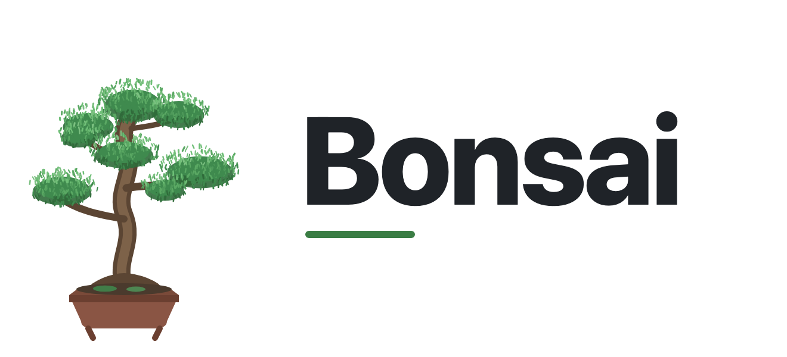

<p align="center">
  <picture>
    <source media="(prefers-color-scheme: dark)" srcset="assets/logo-dark.png">
    
  </picture>
</p>

<h1 align="center">Bonsai</h1>

<p align="center"><em>Every cut deliberate. Nothing grown that need not grow.</em></p>

<p align="center">
  
  
  
  
</p>

---

A bonsai is not a small tree because it was starved. It is small because every
cut was deliberate. Bonsai puts that instinct inside your AI agent: it questions
whether the code needs to exist at all, reaches for the standard library before
custom code and native platform features before dependencies, and prefers one
line to fifty.

The best code is the code you never grew.

## How it works

Before writing code, the agent stops at the first cut that holds:

```
1. Does this need to exist?   → no: skip it (YAGNI)
2. Stdlib does it?            → use it
3. Native platform feature?   → use it
4. Installed dependency?      → use it
5. One line?                  → one line
6. Only then: the minimum that works
```

Small, not negligent: trust-boundary validation, data-loss handling, security,
and accessibility are never on the chopping block. Every deliberate shortcut is
marked with a `bonsai:` comment naming its ceiling and regrow path, so
`/bonsai-debt` can later harvest them into a ledger and "later" doesn't become
"never".

## Install

The Claude Code and Codex plugins run two tiny Node.js lifecycle hooks, so
`node` needs to be on your PATH. If it isn't, the skills still work — the
always-on activation just stays quiet instead of erroring.

### Claude Code

```
/plugin marketplace add SUDARSHANCHAUDHARI/Bonsai
/plugin install bonsai@bonsai
```

Then open `/hooks`, trust the two lifecycle hooks, and start a new thread.
Add the statusline badge when prompted on first run.

### Codex

Install the plugin from this repo; it reuses the same `skills/` and
`hooks/hooks.json`. Restart Codex to pick it up.

### Instruction-only agents

Cursor, Windsurf, Cline, GitHub Copilot, and Kiro load the always-on ruleset
(no `/bonsai` levels or hooks) — copy the matching file:

| Agent | File |
|-------|------|
| Cursor | [`.cursor/rules/bonsai.mdc`](.cursor/rules/bonsai.mdc) |
| Windsurf | [`.windsurf/rules/bonsai.md`](.windsurf/rules/bonsai.md) |
| Cline | [`.clinerules/bonsai.md`](.clinerules/bonsai.md) |
| GitHub Copilot | [`.github/copilot-instructions.md`](.github/copilot-instructions.md) |
| Kiro | [`.kiro/steering/bonsai.md`](.kiro/steering/bonsai.md) |
| Generic | [`AGENTS.md`](AGENTS.md) |

Mapping details: [docs/agent-portability.md](docs/agent-portability.md).

## Commands

| Command | What it does |
|---------|--------------|
| `/bonsai [lite \| full \| ultra \| off]` | Set the intensity, or turn it off. No argument reports the current level. |
| `/bonsai-review` | Review the current diff for over-engineering; hands back a delete-list. |
| `/bonsai-audit` | Same lens across the whole repo, not just the diff. |
| `/bonsai-debt` | Harvest the `bonsai:` shortcuts you've deferred into a ledger. |
| `/bonsai-help` | Quick reference for the commands above. |

## Levels

| Level | Behavior |
|-------|----------|
| `lite` | Build what's asked, but name the smaller alternative. You pick. |
| `full` | The cut order enforced. Shortest diff. **Default.** |
| `ultra` | YAGNI extremist — ship the one-liner and challenge the requirement itself. |

Set the default for every new session with `BONSAI_DEFAULT_MODE`
(`lite`/`full`/`ultra`/`off`), or a `defaultMode` field in
`~/.config/bonsai/config.json` (`%APPDATA%\bonsai\config.json` on Windows).
Default is `full`.

## Roadmap

Shipped in 0.1: Claude Code + Codex plugins, five skills/commands, seven
instruction-only adapters, statusline badge, and a runnable benchmark harness.

Coming next:

- **Published benchmark numbers** — median LOC / cost / latency across models. Harness is in [`benchmarks/`](benchmarks/) today; results land once the correctness gate below is in.
- **Correctness gate** — execute the email/debounce/CSV outputs and structurally check React/FastAPI, so a short-but-broken answer can't win on size.
- **More full-tier adapters** — OpenCode, pi, and Gemini/Antigravity (skills + hooks, not just instructions).
- **Statusline auto-setup** — offer to write the `statusLine` config on first run instead of only nudging.
- **`bonsai-debt` persistence** — one flag to write the ledger straight to `BONSAI-DEBT.md`.

## Development

```bash
npm test                          # rule-copy sync check + unit tests
node scripts/check-rule-copies.js # adapters still match AGENTS.md?
```

When you change the canonical compact ruleset, edit the block in `AGENTS.md`
(between the `BONSAI:BEGIN`/`END` markers) and recopy it into the adapter files;
`check-rule-copies.js` fails if they drift.

## Credit

Concept inspired by [ponytail](https://github.com/DietrichGebert/ponytail) (MIT)
and the "lazy senior dev" pattern. This is an independent, reworked take —
different persona, code, and rule text.

## License

[MIT](LICENSE). Built by [Sudarshan Chaudhari](https://github.com/SUDARSHANCHAUDHARI) — SudarshanTechLabs.
